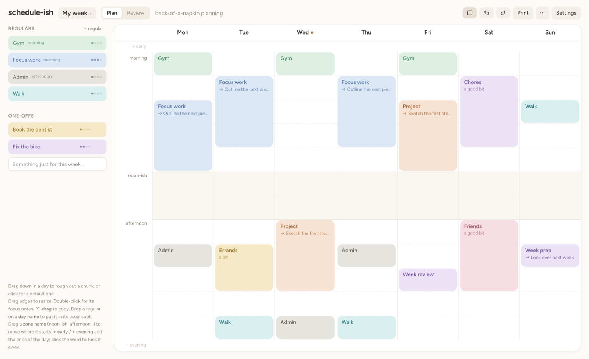
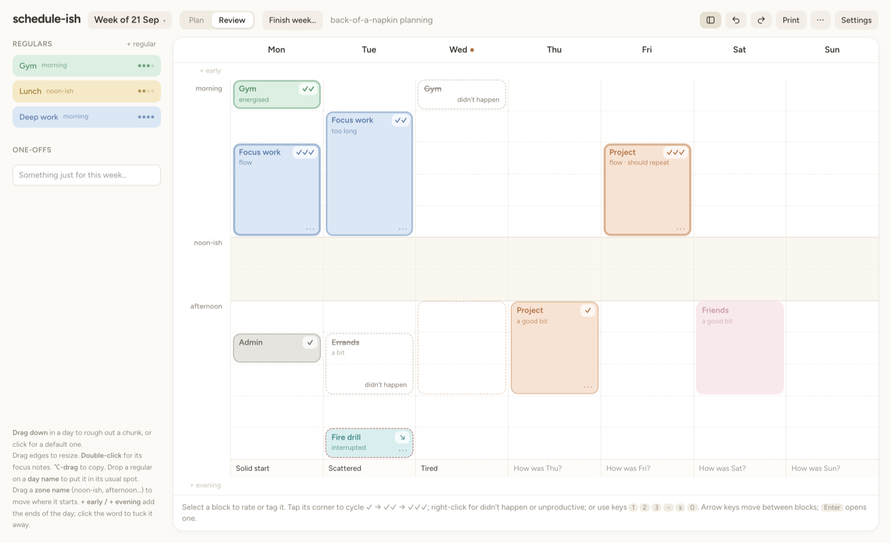
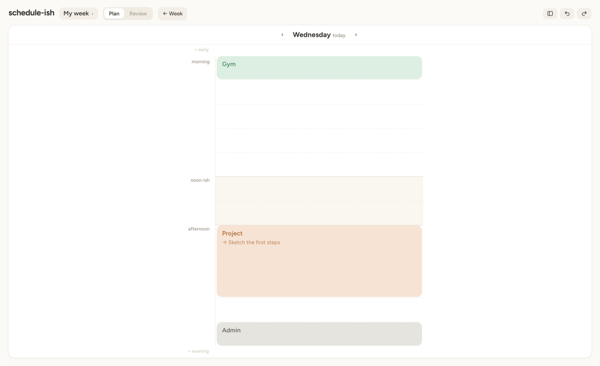

# schedule-ish

Back-of-a-napkin planning. Rough out your week in broad chunks ("a bit of
gym in the morning, a good chunk of focus work after that") with no clock
times. It shows roughly where your focus goes, then helps you look back at
how the week went. It's a focus aid, not a to-do list.



One HTML page and a few small scripts: no build step, no install, no
account. Everything stays in your browser.

## Running it

Open `index.html` in a browser. Or serve the folder:

```bash
python3 -m http.server 8000 --directory schedule-ish
```

It loads Tailwind and the Figtree font from CDNs, so the first load needs a
connection.

## Planning

**The day** has no hours, just soft zones: *morning*, *noon-ish* and
*afternoon*, plus optional *early* and *evening* (**+ early** / **+
evening**; click the name to tuck it away). Drag a zone's name to move where
it starts; blocks in the way are pushed along.

**Blocks**
- **Drag down** in a day to rough one out (or click), type a name, Enter.
- **Drag** to move, **drag an edge** to resize, **⌥-drag** to copy.
- Hover for tools: colour, duplicate, save as a regular, delete.
- Sizes read as *a smidge*, *a bit*, *a good bit*, *a big chunk*.
- **Arrow keys** move between blocks; **Enter** or **double-click** opens
  one.

**Focus notes.** Every block with the same name shares one short list: the
top open line is *what's next*, and shows on the block (→). Each block can
also have a one-line note for that session. Blocks that just hold time
(gym, lunch) can be marked **just holding time** and get a plain note
instead.

**Sidebar**
- **Regulars** are things you do often, with a size, colour and usual zone.
  Drag one into a day for a copy, or onto a day's name to drop it in its
  usual zone.
- **One-offs** are extras just for this week. Type one in, drag it onto the
  week.

**Weeks.** The week menu (*My week ▾*) switches between weeks, renames or
deletes one, and starts a **new week**, ticking what to keep from this one:
the plan, the regulars, the one-offs.

## Reviewing

Switch to **Review** to look back. Nothing there changes the plan.



- **Rate** a block: hover and tap **✓?** to cycle ✓ → ✓✓ → ✓✓✓, or use
  **1 / 2 / 3**. Right-click (or **s** / **−**) for *didn't happen* or
  *unproductive*. Unrated blocks are fine: they're placeholders.
- **Tag** the selected block from the bar at the bottom (*flow*,
  *interrupted*, *too long*, …), or add your own.
- **What actually happened:** drag a block to where it really went, or
  resize it; a faint ghost marks the plan. Draw on empty space for
  something unplanned.
- **Review** a block by double-clicking it, and jot a line under each day
  (*How was Tue?*).

**Finish week…** closes the week: print or export it first if you like,
tick what the next week keeps, and it's saved to an archive in the browser
before the week starts again. ⌘Z undoes it.

**⋯ → Browse finished weeks** lists them by the day they were finished.
Pick one to **View** it (on the board, read-only, printable), **Restore**
it as a live week (reviews and all), **Copy** its plan into a new week, or
**Export** it. **⋯ → Download all finished weeks** saves the lot as JSON.

## Day view

Press **Space** to zoom into today, or double-click a day's name. One day
fills the screen, the planning tools step aside, and blocks show more of
their notes. **← / →** change day; **Space** or **Esc** go back.



## Printing

**Print** follows the mode you're in, on landscape pages:
- **Plan:** the week, then each name's focus lines.
- **Review:** the week as it went, then *how the week went*: what worked,
  what didn't (unproductive, didn't happen, bad tags, ran long or short,
  moved), each name, the tags and the day notes.

**⋯ → Print plan and review** prints all four pages, and so does Finish
week's print button.

## On a phone

A phone gets a read-only view: one day at a time in portrait (swipe or ‹ ›
to change day), the whole week in landscape. The week menu switches weeks;
nothing can be edited. Tablets and desktops work as normal.

## Saving and sharing

Everything saves to the browser (`localStorage`) as you go, including where
you were. **⋯** has **Settings**, **Export** / **Import** (JSON) and **Clear
this week's blocks**. ⌘Z / ⇧⌘Z undo and redo almost everything.

**The default week.** A browser with nothing saved starts from
`weeks/index.js`, then keeps its own copy.

**Shared schedules.** **⋯ → Export as a shared schedule** downloads
`<id>.js`. Put it in `weeks/` and share `index.html?weeks=<id>` (try
`?weeks=example`). Visitors get their own copy in their browser, apart from
their own schedule; a bar offers **Reset to the published version**, and
says when the published file has changed. Shared files are scripts, not
JSON, so they also work when the page is opened straight from disk.

## Code

| File | What |
|---|---|
| `index.html` | Page shell and styles (Tailwind plus a small `<style>` block) |
| `model.js` | Pure logic: zones, snapping, layout, loading, summaries. No DOM. |
| `share.js` | Which schedule to show (`?weeks=<id>` or your own) and where it's stored |
| `app.js` | Rendering, dragging, dialogs, undo, print |
| `weeks/` | The default week (`index.js`) and shared schedules |
| `test/model.test.js` | Tests for `model.js` |

```bash
node --test schedule-ish/test/*.test.js
```

The script tags in `index.html` carry `?v=`: bump it whenever the scripts
change, so browsers don't mix old and new files.

Design notes and plans are in [`docs/`](../docs/).

## Not yet

- Editing on a phone (it's read-only there).
- An on-screen "week in review".
