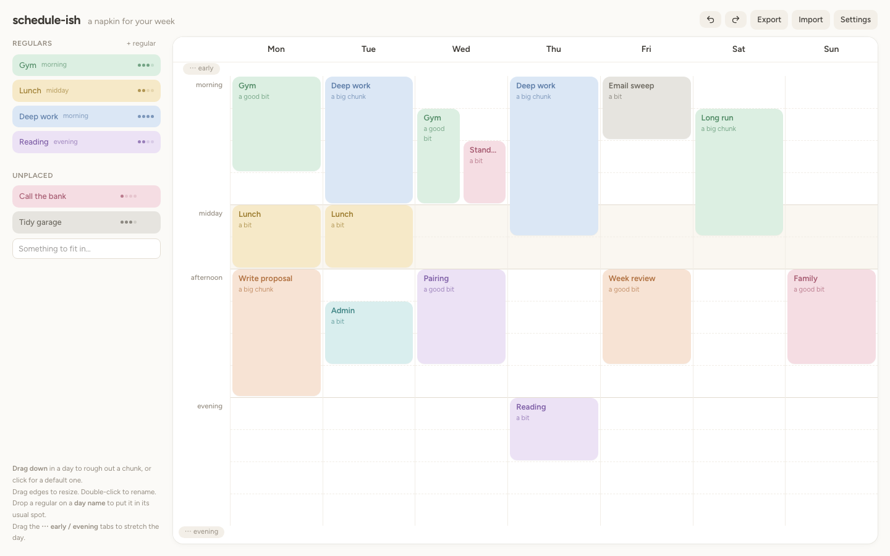

# schedule-ish

Your week on a napkin. Rough out chunks of time ("a good bit of gym in the
morning, a big chunk of writing after lunch") with no clock times. It's
meant to show roughly where your focus goes, not to be a timetable.



It's entirely client-side: one HTML page and two small scripts, with no build
step and no install.

## Running it

Open `index.html` in a browser. That's it.

If you'd rather serve it (some browsers are fussy about `file://`):

```bash
python3 -m http.server 8000 --directory schedule-ish
```

Then go to <http://localhost:8000>.

The page loads Tailwind (jsDelivr) and the Figtree font (Google Fonts) from
CDNs, so it needs a network connection on first load.

## Using it

**Weeks.** The dropdown next to the title shows which week you're on, e.g.
*My week ▾*. Each week is its own live board, with its own blocks, zone
breaks and early/evening. Whatever you change is saved into the week you're
on. The dropdown can:
- switch to another week;
- start a **new blank week**, or a **new one from this week** (a full copy,
  notes and ticks included);
- **rename** or **delete** this week (deleting asks first, and ⌘Z brings it
  back).

Days shown, regulars and the unplaced list are shared by all weeks.

**The day** has no hours. It's split into soft zones: *morning*, *midday*
(tinted, for lunch) and *afternoon*. Faint lines mark the day off, and
blocks snap to each line and halfway between lines, so they can be small
and move smoothly. The visible zones always fill the board's full height.
- **Move a break:** hover a zone name (*midday*, *afternoon*, …) until the
  cursor shows ↕, then drag. That moves where the zone starts, trading
  steps only with the zone above it. Every zone keeps at least one step, and
  the day's overall length stays the same. The moving line **pushes** the
  blocks in the zone that shrinks, and they push the next ones. If they run
  out of room they **compress**, biggest first. Drag the line back (in the
  same drag) and they return; otherwise ⌘Z.
- **Early and evening** are optional. Click **+ early** or **+ evening** to
  add one. Once it's open, **click its name** to tuck it away again (a faint
  − shows on hover). Evening's name can also be dragged to move its break:
  a click tucks it away, a drag moves it. A zone won't hide while blocks are
  still in it.
- Opening one takes a quarter of the height (a fifth each if both are open),
  and the other zones shrink proportionally. Collapsing it puts everything
  back exactly.

**Blocks**
- **Drag down** in a day to rough out a chunk, or **click** for a default one.
  Type a name and press Enter. Escape (or leaving it blank) throws it away.
- **Drag** a block to move it, including to another day.
- **Drag its top or bottom edge** to resize it.
- **Double-click** to open its **notes** (the title is editable there too).
  Select a block and press Enter for a quick inline rename.
- Hover for tools: ● change colour, ⧉ duplicate, ☆ save as a regular,
  × delete. Delete or Backspace also removes the selected block.
- **Duplicate** puts the copy straight after the original. If there's no
  room there, it goes to the same spot on the next day (a note says so), and
  failing that, the first free gap on the same day. Or **⌥-drag** a block to
  drag a copy wherever you like.
- Blocks that overlap sit side by side. Sizes read as *a smidge*, *a bit*,
  *a good bit* or *a big chunk* rather than durations.
- Blocks with the same name get the same colour.

**Notes** are a short list of lines. Type, and press Enter for the next line.
Backspace on an empty line removes it. Click a line's **•** to turn it into
a tick box **☐**, then **☑**, then back. A new line after a tick box is a
tick box too. Escape, ⌘Enter or *Done* closes the dialog. A block with notes
shows **⋯** on the board; the text itself stays in the dialog. Notes travel
with duplicates, copies of the week, and trips to the unplaced list.
Regulars can hold **default notes**, which each copy you drop starts with.

**Regulars** (sidebar) are templates for things you do often: a name, a
rough size, a colour, and optionally a usual zone ("usually in the …", or
*whenever*). Dragging one onto the week drops a *copy*, and the regular stays
in the list.
- Drop it **inside a day** to place it where you let go.
- Drop it **on a day's name** to put it in the first free gap in its usual
  zone, or, with *whenever*, the first free gap from the top of the day. While
  you drag, the day names are outlined as drop targets, and the one under
  the pointer says where it will land (e.g. *Tue → morning*). Unplaced items
  work the same way, using *first gap*.
- Click a regular to edit or delete it; **+ regular** makes a new one.
- **Reorder** regulars by dragging one up or down within the list. A line
  shows where it will land. The unplaced list reorders the same way.

**Unplaced** (sidebar) is a list of one-off things you'd like to fit in
somewhere. Type one in and press Enter. Dragging it onto the week *moves* it
there. Dragging a block from the week back onto this list takes it off the
week.

**PDF** is a shortcut for the browser's print (⌘P does the same). It opens
the print dialog with the week on one landscape page. The week's name is at
the top, the sidebar and buttons are hidden, and the colours are kept. If
any blocks have notes, a **second page** lists them under "Day · name"
headings. Choose "Save as PDF" as the destination, or print it.

**Sidebar**: the header button next to undo shows or hides it. Settings
can put it on the left or the right.

**Settings** set the first day of the week, which days to show, the sidebar
side, and the optional zones. You can also clear all blocks there. **Undo/redo**:
⌘Z / ⇧⌘Z (Ctrl on other platforms), or the header buttons.

## Saving

Everything (all weeks) autosaves to the browser's `localStorage`, per browser and per
origin. That means opening the file directly and serving it over
`localhost` give you separate plans.

**Export** downloads everything (all weeks, regulars, unplaced) as JSON. **Import** loads one back and
replaces the current plan (undoable).

## Code

| File | What |
|---|---|
| `index.html` | Page shell, Tailwind, and a small `<style>` block for the grid, blocks and print layout |
| `model.js` | Pure logic: zones and steps, snapping, overlap layout, gap finding, loading/validation. No DOM. |
| `app.js` | Rendering, pointer-event drag/resize (blocks and zone breaks), sidebar, popovers, persistence, undo, print |
| `test/model.test.js` | Unit tests for `model.js` |

Run the tests with Node 18 or later (no dependencies):

```bash
node --test schedule-ish/test/*.test.js
```

The design notes are in
[`docs/2026-09-24-1450_DESIGN_schedule-ish.md`](../docs/2026-09-24-1450_DESIGN_schedule-ish.md).

## Not yet

- Comparing plan to reality: marking how a day actually went against how it
  was planned.
- Attributes on blocks beyond name, size and colour.
- Phone layout. It's built for landscape screens: desktop first, and fine on
  a tablet.
